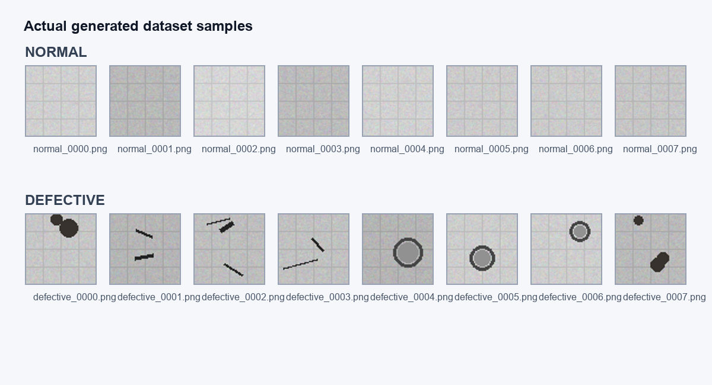
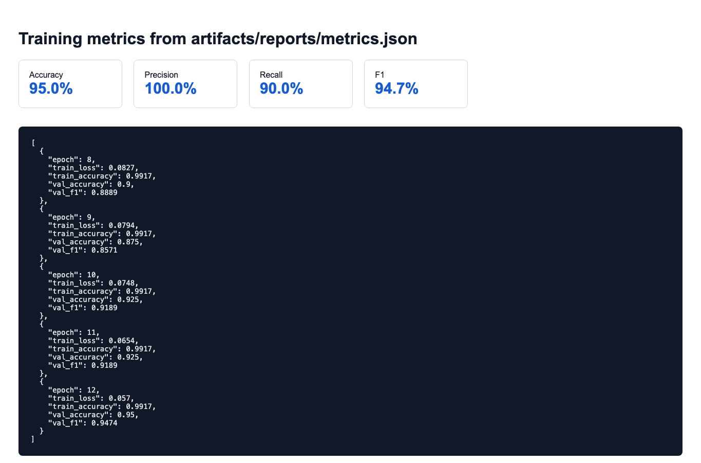
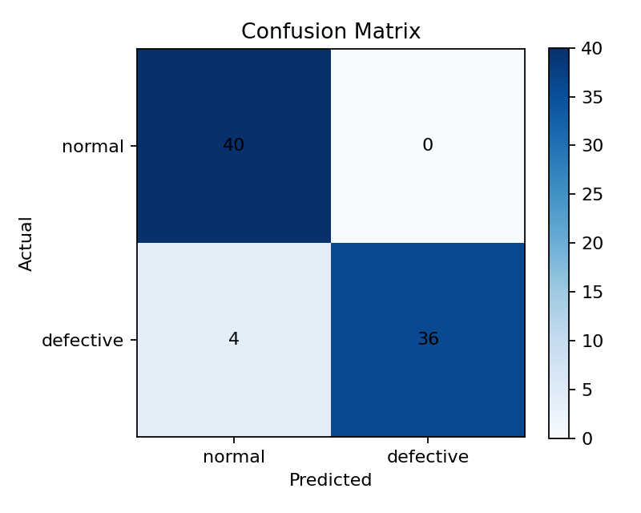
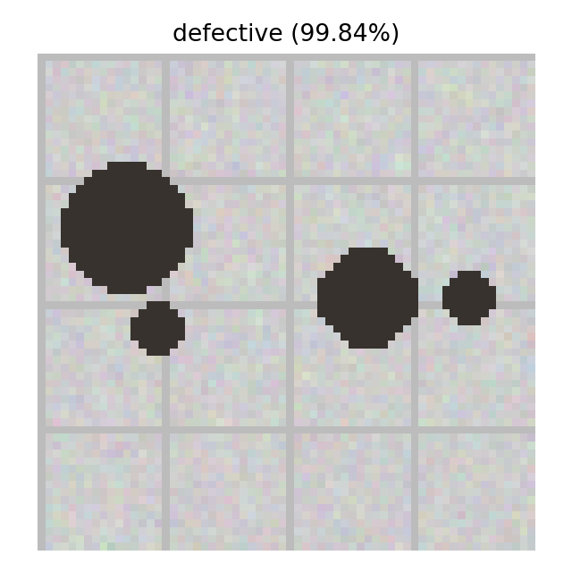
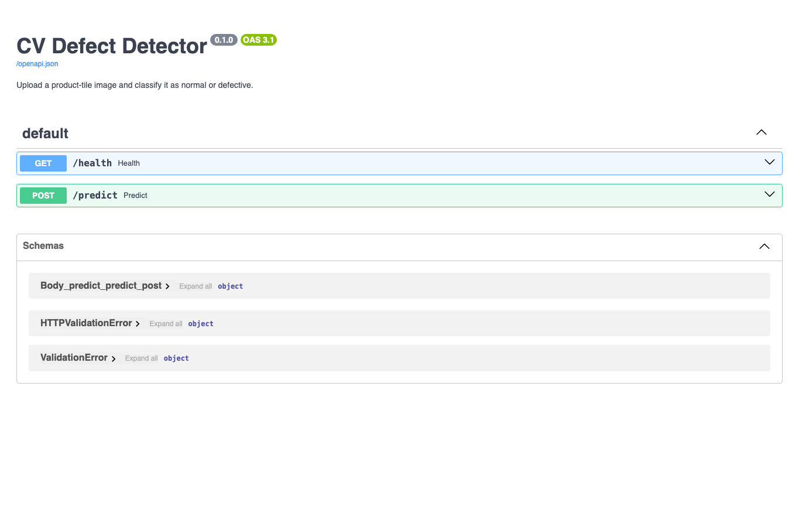

# CV Defect Detector

A compact computer vision pipeline for automated visual defect detection using PyTorch and FastAPI.

The project generates a synthetic image dataset, trains a convolutional neural network (CNN) for binary classification (`normal` vs `defective`), evaluates model performance, and exposes inference through both CLI utilities and a REST API.

---

## Features

- Synthetic image dataset generation for reproducible experiments
- CNN-based binary image classification
- Training and evaluation pipeline with saved metrics and plots
- FastAPI inference service with Swagger/OpenAPI documentation
- CLI utilities for prediction and evaluation
- Automated tests using `pytest`
- Saved artifacts including:
  - trained model
  - confusion matrix
  - training curves
  - prediction visualizations

---

## Tech Stack

- Python
- PyTorch
- FastAPI
- NumPy
- Pillow
- Matplotlib
- Pytest

---

## Quick Start

### Create Virtual Environment

```bash
python -m venv .venv
```

### Activate Environment

**Linux/macOS**

```bash
source .venv/bin/activate
```

**Windows PowerShell**

```powershell
.\.venv\Scripts\Activate.ps1
```

### Install Dependencies

```bash
pip install -e ".[dev]"
```

---

## Generate Dataset

```bash
python scripts/generate_dataset.py --overwrite
```

Generated images will be stored under:

```text
data/processed/synthetic_defects/
```

---

## Train Model

```bash
python scripts/train.py --epochs 8
```

Training artifacts are saved under:

```text
artifacts/
```

Including:
- trained model weights
- metrics
- confusion matrix
- training plots

---

## Run Prediction

```bash
python scripts/predict.py \
data/processed/synthetic_defects/val/defective/defective_0000.png \
--plot-path artifacts/predictions/defective_prediction.png
```

---

## Run API

Start the FastAPI server:

```bash
uvicorn defect_detector.api.main:app --reload
```

Open Swagger UI:

```text
http://localhost:8000/docs
```

Available endpoints:
- `GET /health`
- `POST /predict`

---

## Run Tests

```bash
pytest
```

Additional examples:

```bash
python scripts/evaluate.py
python -m pytest tests/test_api.py
```

---

## Screenshots

The screenshots below were generated from real project execution, including:
- generated dataset samples
- training metrics
- prediction output
- FastAPI Swagger/OpenAPI documentation

### Dataset Examples



### Training Metrics



### Confusion Matrix



### Prediction Output



### FastAPI Swagger UI



---

## Repository Structure

```text
src/defect_detector/
    model, dataset, training, inference, API

scripts/
    command-line entry points

tests/
    training, inference, and API tests

data/processed/
    generated synthetic dataset

artifacts/
    trained models, reports, metrics, plots

docs/screenshots/
    README screenshots
```

---

## Example Workflow

```bash
python scripts/generate_dataset.py --overwrite
python scripts/train.py --epochs 8
python scripts/evaluate.py

uvicorn defect_detector.api.main:app --reload
```

---

## Output Artifacts

Example generated outputs:

```text
artifacts/models/defect_cnn.pt
artifacts/reports/confusion_matrix.png
artifacts/reports/training_metrics.json
artifacts/predictions/defective_prediction.png
```
